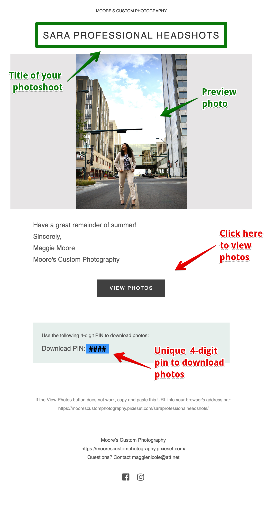
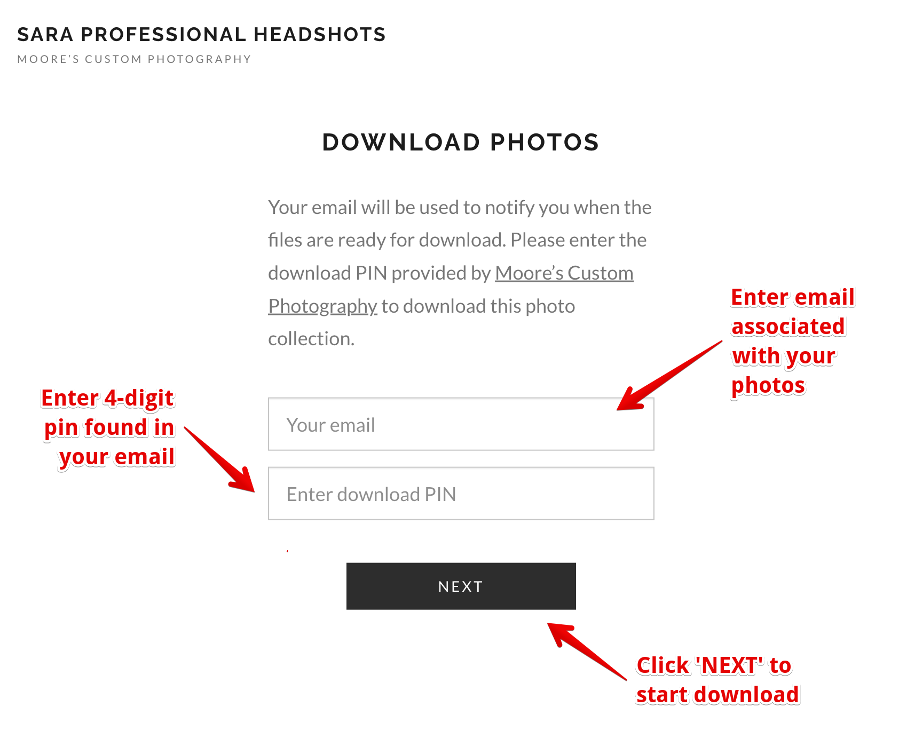
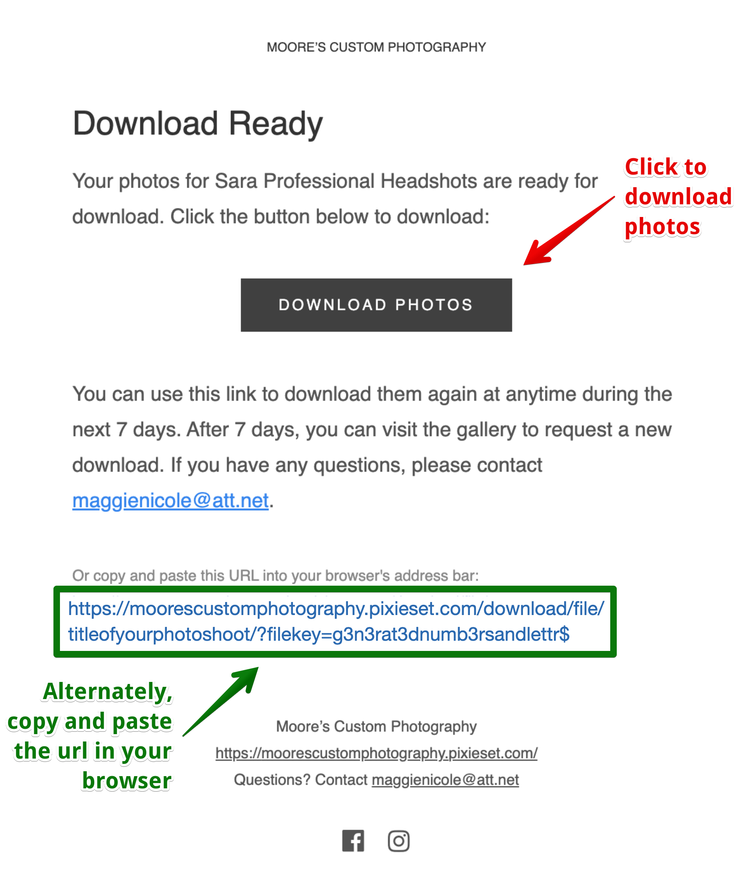
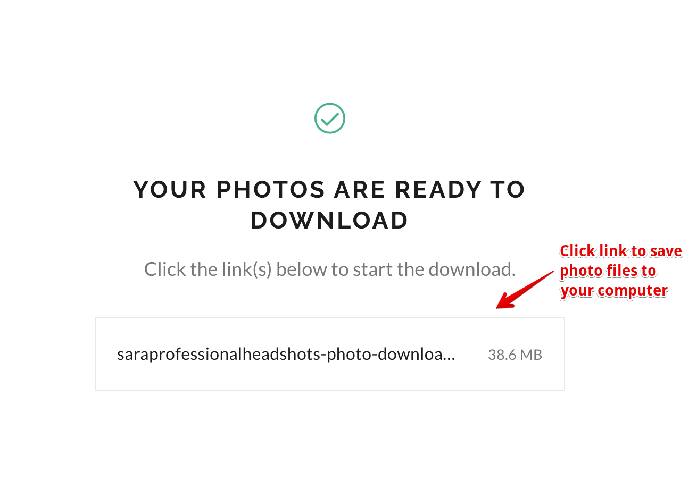
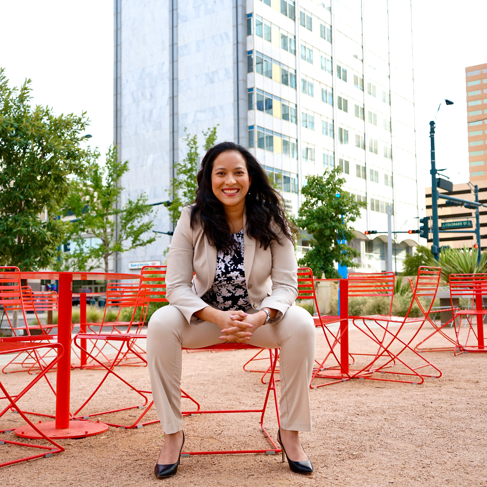
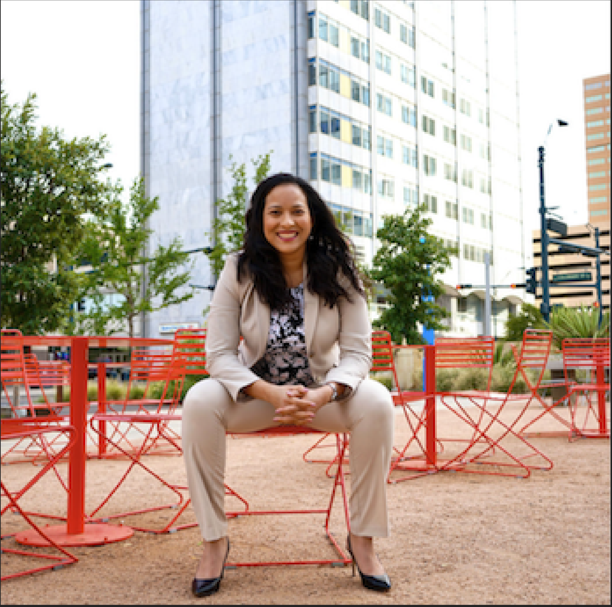

Moore's Custom Photography

##

<ins>Downloading Your Pictures </ins>

##
<!--  -->
<figure>
    
</figure>

> **Warning!** *Nothing says unprofessional like a low resolution photo*

##
#

In this step by step guide we will show you how to download your photographs.  <ins>How you access/download your photographs matters</ins>, and this tutorial will demonstrate how to retain the high quality that you've come to expect from our studio. 

#

## 
<ins>**Step 1:**</ins>
 

 You will receive an email once your pictures are ready. Click view photos or copy the link in your browser to see all your photos. Make sure to save the Download PIN which will give you access to request a download. 

<!--  -->
<figure>
    

</figure>

#

## 
<ins>**Step 2:**</ins>
 

You can browse and view all the highlights of your photoshoot. When you're done browsing, click the download arrow in the upper right hand corner to download the entire library.

<!--  -->
<figure>
    

</figure>

#

## 
<ins>**Step 3:**</ins>
 

Enter your email associated with your photos and the 4-digit pin you were sent earlier. Click 'NEXT' to continue. 

<!--  -->
<figure>
    

</figure>

#

## 
<ins>**Step 4:**</ins>
 

You will be sent an email once your photos are ready for download. Click the button or follow the url to access photos.

<!--  -->
<figure>
    

</figure>

#

## 
<ins>**Step 5:**</ins>
 

Almost there! Click the file link to download to your device. 

<!--  -->
<figure>
    

</figure>

##
#

The final product is you can be proud of! No more sharing blurry pictures with friends and family. Impress employers and celebrate the captured moment(s). 

<!--  -->
<figure>
    

</figure>

> **Note:** *High Quality images reflect the talents of the photographer and your attention to detail*

#

## Contributing
[Sara Baqla](https://github.com/missatrox44)

## Questions
Github username: [missatrox44](https://github.com/missatrox44)  
Email: missatrox44@gmail.com

<!-- Avoid

> **Note:** *Nothing says unprofessional like a low resolution photo* -->